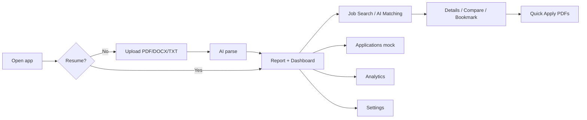

# CareerProAI — User Journey

No login. Opening the app *is* the session. Goal: **upload a CV → get an ATS score → see live jobs matched to that resume → download a tailored apply pack.**

---

## 1. Open the app

Chrome is always there: sidebar, top job search, dark mode, later a profile-initials switcher.

**Nav:** Dashboard · Resume · Job Search · AI Matching · Applications · Analytics · Settings. Bottom CTA **Analyze Resume** goes to Resume.

Until a resume exists, **every tab except Resume** shows *“No resumes yet”* + **Go to Resume Upload**. Loading shows a spinner; API down shows Retry.

On Vercel the DB is `/tmp` — a cold start can wipe uploads and send the user back to this gate.

---

## 2. Upload and parse

Resume tab: **Upload** or **Detailed Report**.

Drop a **PDF / DOCX / TXT ≤ 5 MB**, or **Browse Files**, or paste text. Invalid type/size is blocked. Preview → **Analyze Resume**.

Wait screen: progress + skeletons. Groq runs first; Gemini (then optional DeepSeek) if Groq fails. Success toast, then the report. Failure: branded error + **Retry** (never raw API text).

**Report:** name, score 0–100, ATS badge, contact (email / LinkedIn / GitHub), strengths, improvements, experience, skills, gap analysis (add missing skills), projects, education, certs, upload history. **Download PDF**, **Share**, **Update Resume**. Extra uploads become extra profiles; the initials menu switches the active one (jobs follow that id).

If LinkedIn/GitHub come back without `https://`, those links break (relative to this site).

---

## 3. Dashboard

*“Welcome back, {first name}.”*

KPIs: Resume Health (score), Active Apps (**mock** count), New Matches (≥75% AI fit), Skills Tracked. Then top jobs + **Quick Apply**, resume summary, recommendations, mock activity, skills, education.

---

## 4. Find jobs

Needs a configured AI key (`aiConfigured`). Search uses the profile’s current/target role.

Loads **bdjobs** and **LinkedIn** in parallel (~50 each). One source failing does not hide the other.

AI scores listings in chunks. A failed chunk leaves cards as **NOT AI-SCORED** instead of blanking the page.

**Job Search** = all jobs. **AI Matching** = same list, starts on **Highly Recommended** (≥75%). Search box: title / company / skill. Sort: Relevance, Latest, Salary, Best Match. Two columns: BDJOBS | LinkedIn.

Per card: match %, bookmark, details, compare (Match Matrix), **Quick Apply**. Bookmark saves in SQLite per resume (no Saved Jobs nav item). Details/compare are modals; compare calls the AI for experience alignment.

---

## 5. Quick Apply

Does **not** apply on bdjobs/LinkedIn. Needs email + at least one experience row.

Generates a tailored resume + cover letter (cached per profile+job). User **downloads PDFs**. That does **not** add a row to Applications.

---

## 6. Applications, Analytics, Settings

**Applications** — mock pipeline (Applied / Screening / Interviewing / Offered). Status/notes stay until refresh. **Reset sandbox** restores this mock only; real resumes stay.

**Analytics** — real score history per upload, skills, gaps. Application charts are mock.

**Settings** (after a resume exists) — edit profile/account, switch/delete resumes, dark mode, AI **Configured** badge (never the key), notification prefs, sandbox reset. Security copy: no login yet.

---

## 7. Whole loop in one pass

1. Open app → empty gate → Resume.  
2. Upload CV → Analyze → scored report.  
3. Dashboard KPIs.  
4. Job Search / AI Matching → two live columns, some scored.  
5. Details / compare / bookmark / Quick Apply PDFs.  
6. Applications (mock) · Analytics · Settings.

**Real:** resume parse, profiles, live jobs, match scores, bookmarks, apply PDFs.  
**Mock:** applications table, activity timeline.  
**Not in the product:** login, submitting an application to the job site.
